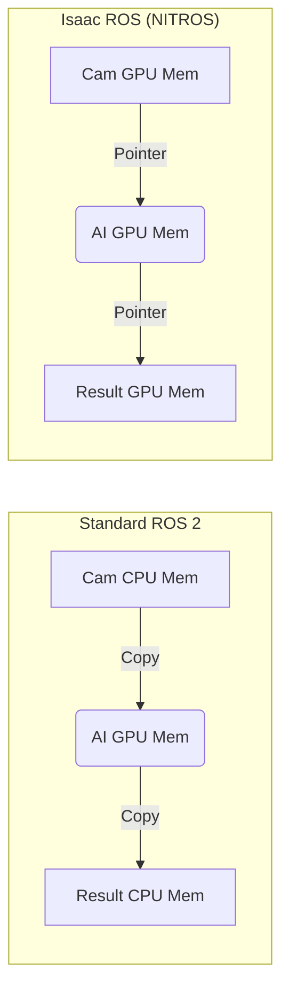

# Module 3: The AI-Robot Brain (NVIDIA Isaac)

## 1. Beyond Basic Simulation

While Gazebo is great for physics, **NVIDIA Isaac** is built for **AI**. It leverages the Omniverse platform (USD format) to create photorealistic worlds and train neural networks faster than real-time.

### 1.1 The Isaac Stack

1.  **Isaac Sim**: The simulator. It runs on RTX GPUs and supports ray-tracing.
2.  **Isaac ROS**: A set of hardware-accelerated ROS 2 packages. These use the CUDA cores on your Jetson Orin to run heavy algorithms like VSLAM and Object Detection.
3.  **Isaac Lab (formerly Orbit/Isaac Gym)**: A framework for Reinforcement Learning (RL). It allows you to simulate thousands of robots in parallel to train walking policies.

---

## 2. Isaac ROS: GPU Acceleration

Standard ROS nodes run on the CPU. Isaac ROS nodes run on the GPU (and specialized accelerators like PVA/VIC on Jetson).

### Example: NITROS (NVIDIA Isaac Transport for ROS)

When passing a 4K image from a camera node to an AI node, copying data from CPU to GPU memory is slow. **NITROS** is a customized transport (like zero-copy) that keeps the data in GPU memory the whole time.

---

## 3. Synthetic Data Generation (SDG)

Training a vision model (like YOLO) requires thousands of labeled images. Labeling by hand is slow.

**Isaac Replicator** allows you to script the generation of training data:
1.  **Scene**: A kitchen.
2.  **Object**: A "Mustard Bottle" (YCB Dataset).
3.  **Randomization**:
    -   Change the lighting (Morning, Noon, Night).
    -   Change the texture of the table (Wood, Metal, Marble).
    -   Change the camera position.
4.  **Output**: 10,000 perfectly labeled images in minutes.

This technique is crucial for "Sim-to-Real" transfer in vision.